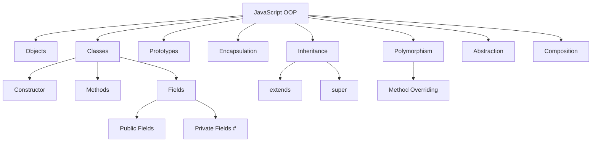

# JavaScript Object-Oriented Programming

## 1. Introduction to OOP

Object-Oriented Programming (OOP) is a programming paradigm based on **objects**.

An object combines:

- **data** — properties
- **behavior** — methods

For example:

```javascript
const user = {
    firstName: "John",
    lastName: "Smith",

    getFullName() {
        return `${this.firstName} ${this.lastName}`;
    }
};

console.log(user.getFullName());
// John Smith
```

The object contains both the user's data and behavior related to that data.

### Why use OOP?

OOP can help us:

- organize large applications;
- group related data and behavior;
- reuse code;
- model real-world concepts;
- hide implementation details;
- make applications easier to maintain.

---

## 2. Objects in JavaScript

Objects are one of the fundamental building blocks of JavaScript.

### Object literal

The simplest way to create an object is an object literal:

```javascript
const car = {
    brand: "Toyota",
    model: "Corolla",
    year: 2024
};
```

Properties can be accessed using dot notation:

```javascript
console.log(car.brand);
console.log(car.model);
```

or bracket notation:

```javascript
console.log(car["brand"]);
console.log(car["model"]);
```

### Adding and changing properties

```javascript
car.color = "red";
car.year = 2025;

console.log(car);
```

### Deleting properties

```javascript
delete car.color;
```

---

## 3. Methods

A function stored inside an object is called a **method**.

```javascript
const calculator = {
    add(a, b) {
        return a + b;
    },

    subtract(a, b) {
        return a - b;
    }
};

console.log(calculator.add(10, 5));
// 15
```

Methods allow an object to describe not only **what it has**, but also **what it can do**.

---

## 4. The `this` Keyword

The `this` keyword usually refers to the object associated with the current method call.

```javascript
const person = {
    firstName: "John",
    lastName: "Smith",

    getFullName() {
        return `${this.firstName} ${this.lastName}`;
    }
};

console.log(person.getFullName());
// John Smith
```

Here:

```javascript
this.firstName
```

refers to:

```javascript
person.firstName
```

### Important

The value of `this` is determined by **how a function is called**, not simply where it was defined.

For example:

```javascript
const person = {
    name: "John",

    sayHello() {
        console.log(`Hello, ${this.name}!`);
    }
};

person.sayHello();
// Hello, John!
```

---

## 5. Creating Multiple Similar Objects

Suppose we need many users:

```javascript
const user1 = {
    name: "John",
    age: 30
};

const user2 = {
    name: "Alice",
    age: 25
};

const user3 = {
    name: "Bob",
    age: 35
};
```

This works, but it becomes repetitive.

We need a way to create objects from a common definition.

There are several approaches in JavaScript:

1. Factory functions
2. Constructor functions
3. Classes

---

# 6. Factory Functions

A **factory function** is a function that creates and returns objects.

```javascript
function createUser(name, age) {
    return {
        name,
        age,

        sayHello() {
            console.log(`Hello, I'm ${this.name}`);
        }
    };
}

const user1 = createUser("John", 30);
const user2 = createUser("Alice", 25);

user1.sayHello();
user2.sayHello();
```

Output:

```text
Hello, I'm John
Hello, I'm Alice
```

### Advantages

Factory functions are:

- simple;
- flexible;
- easy to understand;
- useful when object creation requires custom logic.

---

# 7. Constructor Functions

Before ES6 classes, JavaScript commonly used **constructor functions**.

```javascript
function User(name, age) {
    this.name = name;
    this.age = age;
}

const user1 = new User("John", 30);
const user2 = new User("Alice", 25);
```

The `new` keyword creates a new object.

Methods can be added to the prototype:

```javascript
User.prototype.sayHello = function () {
    console.log(`Hello, I'm ${this.name}`);
};

user1.sayHello();
```

This approach is still important because it helps explain how JavaScript's object model works.

---

# 8. Prototypes

JavaScript uses a **prototype-based object model**.

Every ordinary object can have a prototype object from which it can inherit properties and methods.

For example:

```javascript
const user = {
    name: "John"
};

console.log(Object.getPrototypeOf(user));
```

Objects can access properties through the **prototype chain**.

Conceptually:

```text
user
  |
  v
Object.prototype
  |
  v
null
```

When JavaScript evaluates:

```javascript
user.toString();
```

it first looks for `toString` on `user`.

If it isn't there, JavaScript looks at the object's prototype.

Then it continues up the prototype chain.

---

# 9. ES6 Classes

Modern JavaScript provides the `class` syntax.

```javascript
class User {
    constructor(name, age) {
        this.name = name;
        this.age = age;
    }

    sayHello() {
        console.log(`Hello, I'm ${this.name}`);
    }
}
```

Now we can create objects:

```javascript
const user1 = new User("John", 30);
const user2 = new User("Alice", 25);

user1.sayHello();
user2.sayHello();
```

The `class` syntax provides a cleaner way to work with JavaScript's prototype-based object model.

---

# 10. Classes and Objects

A **class** describes the structure and behavior of objects.

An **object** is an instance created from the class.

```javascript
class Car {
    constructor(brand, model) {
        this.brand = brand;
        this.model = model;
    }
}

const car1 = new Car("Toyota", "Corolla");
const car2 = new Car("BMW", "X5");
```

Conceptually:

```text
             Car
              |
       +------+------+
       |             |
       v             v
    car1           car2
  Toyota          BMW
  Corolla         X5
```

---

# 11. Constructors

The `constructor()` method is automatically called when an object is created with `new`.

```javascript
class Person {
    constructor(name, age) {
        this.name = name;
        this.age = age;
    }
}

const person = new Person("John", 30);
```

The constructor initializes the object.

### Constructor parameters

```javascript
class Product {
    constructor(name, price) {
        this.name = name;
        this.price = price;
    }
}

const product = new Product("Laptop", 1200);
```

---

# 12. Instance Methods

Methods defined inside a class are available to its instances.

```javascript
class Rectangle {
    constructor(width, height) {
        this.width = width;
        this.height = height;
    }

    getArea() {
        return this.width * this.height;
    }

    getPerimeter() {
        return 2 * (this.width + this.height);
    }
}

const rectangle = new Rectangle(10, 5);

console.log(rectangle.getArea());
// 50

console.log(rectangle.getPerimeter());
// 30
```

---

# 13. Instance Fields

Properties can be initialized directly in a class.

```javascript
class User {
    role = "user";

    constructor(name) {
        this.name = name;
    }
}

const user = new User("John");

console.log(user.name);
console.log(user.role);
```

---

# 14. Public Fields

By default, class fields are public.

```javascript
class BankAccount {
    balance = 0;

    constructor(owner) {
        this.owner = owner;
    }
}

const account = new BankAccount("John");

account.balance = 1000;
```

Any code that has access to the object can modify public fields.

Sometimes this is not desirable.

This leads us to **encapsulation**.

---

# 15. Private Fields

Modern JavaScript supports private class fields using `#`.

```javascript
class BankAccount {
    #balance = 0;

    constructor(owner) {
        this.owner = owner;
    }

    deposit(amount) {
        this.#balance += amount;
    }

    getBalance() {
        return this.#balance;
    }
}

const account = new BankAccount("John");

account.deposit(500);

console.log(account.getBalance());
// 500
```

This is invalid:

```javascript
account.#balance = 100000;
```

Private fields can only be accessed from inside the class.

---

# 16. Encapsulation

**Encapsulation** means combining data and behavior while controlling access to the internal state of an object.

Example:

```javascript
class BankAccount {
    #balance = 0;

    deposit(amount) {
        if (amount <= 0) {
            throw new Error("Amount must be positive");
        }

        this.#balance += amount;
    }

    withdraw(amount) {
        if (amount > this.#balance) {
            throw new Error("Insufficient funds");
        }

        this.#balance -= amount;
    }

    getBalance() {
        return this.#balance;
    }
}
```

The user of the class doesn't need to know how the balance is stored.

They use a public interface:

```javascript
account.deposit(100);
account.withdraw(50);
console.log(account.getBalance());
```

---

# 17. Getters and Setters

Getters allow us to expose calculated or controlled values.

```javascript
class Person {
    constructor(firstName, lastName) {
        this.firstName = firstName;
        this.lastName = lastName;
    }

    get fullName() {
        return `${this.firstName} ${this.lastName}`;
    }
}

const person = new Person("John", "Smith");

console.log(person.fullName);
```

Notice that we don't call it like a function:

```javascript
person.fullName
```

not:

```javascript
person.fullName()
```

### Setter

```javascript
class User {
    constructor(name) {
        this.name = name;
    }

    set username(value) {
        this.name = value.trim();
    }
}

const user = new User("John");

user.username = " Alice ";

console.log(user.name);
// Alice
```

Getters and setters can be useful for validation and controlled access.

---

# 18. Static Members

A static member belongs to the class itself rather than to individual objects.

```javascript
class MathHelper {
    static square(number) {
        return number * number;
    }
}

console.log(MathHelper.square(5));
// 25
```

We don't create an object:

```javascript
MathHelper.square(5);
```

rather than:

```javascript
const helper = new MathHelper();
```

Static members are useful for functionality that doesn't depend on a particular instance.

---

# 19. Inheritance

**Inheritance** allows one class to reuse and extend another class.

```javascript
class Animal {
    constructor(name) {
        this.name = name;
    }

    eat() {
        console.log(`${this.name} is eating`);
    }
}

class Dog extends Animal {
    bark() {
        console.log(`${this.name} says Woof!`);
    }
}

const dog = new Dog("Rex");

dog.eat();
dog.bark();
```

`Dog` inherits the `eat()` method from `Animal`.

Conceptually:

```text
Animal
   |
   | extends
   v
  Dog
```

---

# 20. The `super` Keyword

`super` is used to access functionality from the parent class.

```javascript
class Animal {
    constructor(name) {
        this.name = name;
    }
}

class Dog extends Animal {
    constructor(name, breed) {
        super(name);
        this.breed = breed;
    }
}

const dog = new Dog("Rex", "Labrador");
```

The parent constructor must be called before using `this` in a derived constructor.

```javascript
super(name);
```

calls the constructor of `Animal`.

---

# 21. Method Overriding

A child class can provide its own implementation of a method.

```javascript
class Animal {
    makeSound() {
        console.log("Some sound");
    }
}

class Dog extends Animal {
    makeSound() {
        console.log("Woof!");
    }
}

class Cat extends Animal {
    makeSound() {
        console.log("Meow!");
    }
}
```

Now:

```javascript
const dog = new Dog();
const cat = new Cat();

dog.makeSound();
cat.makeSound();
```

Output:

```text
Woof!
Meow!
```

---

# 22. Polymorphism

**Polymorphism** means that different objects can respond to the same method call in different ways.

Using the previous example:

```javascript
const animals = [
    new Dog(),
    new Cat()
];

animals.forEach(animal => {
    animal.makeSound();
});
```

Output:

```text
Woof!
Meow!
```

The code doesn't need to know whether `animal` is a `Dog` or a `Cat`.

It simply calls:

```javascript
animal.makeSound();
```

This is one of the most useful ideas in OOP.

---

# 23. Abstraction

**Abstraction** means exposing only the important parts of an object while hiding unnecessary implementation details.

For example:

```javascript
class CoffeeMachine {
    makeCoffee() {
        this.#heatWater();
        this.#grindCoffee();
        this.#brew();
        console.log("Coffee is ready!");
    }

    #heatWater() {
        console.log("Heating water...");
    }

    #grindCoffee() {
        console.log("Grinding coffee...");
    }

    #brew() {
        console.log("Brewing...");
    }
}

const machine = new CoffeeMachine();

machine.makeCoffee();
```

The user only needs:

```javascript
machine.makeCoffee();
```

They don't need to know the internal sequence of operations.

---

# 24. The Four Common OOP Concepts

The four concepts traditionally associated with OOP are:

| Concept | Meaning |
|---|---|
| Encapsulation | Protect and control object state |
| Abstraction | Hide unnecessary implementation details |
| Inheritance | Reuse and extend existing behavior |
| Polymorphism | Same interface, different behavior |

A simplified picture:

```text
                 OOP
                  |
       +----------+----------+
       |          |          |
       v          v          v
 Encapsulation  Inheritance  Polymorphism
       |
       v
   Abstraction
```

These concepts are useful, but JavaScript does not require every program to use all of them.

---

# 25. Composition

Inheritance is not always the best solution.

Consider:

```javascript
class Animal {
    eat() {}
}

class Dog extends Animal {
    bark() {}
}
```

This models an **is-a** relationship:

```text
Dog IS AN Animal
```

Composition models a **has-a** relationship.

For example:

```javascript
const canEat = {
    eat() {
        console.log("Eating...");
    }
};

const canWalk = {
    walk() {
        console.log("Walking...");
    }
};

const dog = {
    name: "Rex",
    ...canEat,
    ...canWalk
};

dog.eat();
dog.walk();
```

The object is composed from different behaviors.

---

# 26. Composition vs Inheritance

### Inheritance

Use inheritance when there is a strong hierarchical relationship.

```text
Vehicle
   |
   +-- Car
   |
   +-- Motorcycle
```

### Composition

Use composition when an object can be assembled from reusable behaviors.

```text
Dog
 |
 +-- canEat
 +-- canWalk
 +-- canRun
```

A useful guideline:

> Prefer composition when inheritance doesn't represent a clear "is-a" relationship.

---

# 27. A Practical Example: E-Commerce

Let's build a small example.

## Product

```javascript
class Product {
    constructor(name, price) {
        this.name = name;
        this.price = price;
    }

    getPrice() {
        return this.price;
    }
}
```

## Shopping Cart

```javascript
class ShoppingCart {
    #items = [];

    addProduct(product) {
        this.#items.push(product);
    }

    getTotal() {
        return this.#items.reduce(
            (total, product) => total + product.getPrice(),
            0
        );
    }
}
```

## Usage

```javascript
const laptop = new Product("Laptop", 1200);
const mouse = new Product("Mouse", 50);

const cart = new ShoppingCart();

cart.addProduct(laptop);
cart.addProduct(mouse);

console.log(cart.getTotal());
// 1250
```

The `ShoppingCart` controls its internal collection of products.

---

# 28. Extending the Example

We can introduce specialized products.

```javascript
class DigitalProduct extends Product {
    constructor(name, price, fileSize) {
        super(name, price);
        this.fileSize = fileSize;
    }
}

class PhysicalProduct extends Product {
    constructor(name, price, weight) {
        super(name, price);
        this.weight = weight;
    }
}
```

Now both objects have:

```javascript
getPrice()
```

but can have different additional behavior.

---

# 29. Polymorphism in the E-Commerce Example

We can introduce different shipping behavior:

```javascript
class Product {
    constructor(name, price) {
        this.name = name;
        this.price = price;
    }

    calculateShipping() {
        return 0;
    }
}

class PhysicalProduct extends Product {
    constructor(name, price, weight) {
        super(name, price);
        this.weight = weight;
    }

    calculateShipping() {
        return this.weight * 2;
    }
}

class DigitalProduct extends Product {
    calculateShipping() {
        return 0;
    }
}
```

Now:

```javascript
const products = [
    new PhysicalProduct("Laptop", 1200, 3),
    new DigitalProduct("E-book", 20)
];

products.forEach(product => {
    console.log(product.calculateShipping());
});
```

The same method call produces different results.

---

# 30. Class Syntax vs Prototype Syntax

These two approaches are closely related.

### Class syntax

```javascript
class User {
    constructor(name) {
        this.name = name;
    }

    sayHello() {
        console.log(`Hello ${this.name}`);
    }
}
```

### Prototype syntax

```javascript
function User(name) {
    this.name = name;
}

User.prototype.sayHello = function () {
    console.log(`Hello ${this.name}`);
};
```

The `class` syntax provides cleaner syntax, but JavaScript still uses prototypes underneath.

---

# 31. Prototype Chain

Consider:

```javascript
class User {
    sayHello() {
        console.log("Hello");
    }
}

const user = new User();
```

Conceptually:

```text
user
 |
 v
User.prototype
 |
 v
Object.prototype
 |
 v
null
```

When we execute:

```javascript
user.sayHello();
```

JavaScript looks for `sayHello`:

1. on `user`;
2. on `User.prototype`;
3. further up the prototype chain if necessary.

---

# 32. `instanceof`

The `instanceof` operator can check whether an object is an instance of a class or constructor.

```javascript
class User {}

const user = new User();

console.log(user instanceof User);
// true

console.log(user instanceof Object);
// true
```

Another example:

```javascript
class Animal {}

class Dog extends Animal {}

const dog = new Dog();

console.log(dog instanceof Dog);
// true

console.log(dog instanceof Animal);
// true
```

---

# 33. `Object.getPrototypeOf()`

We can inspect an object's prototype:

```javascript
class User {}

const user = new User();

console.log(
    Object.getPrototypeOf(user) === User.prototype
);
// true
```

This is useful when learning how JavaScript's prototype system works.

---

# 34. Common OOP Mistakes

## Mistake 1: Using classes for everything

Not every problem needs a class.

Sometimes a simple function is better:

```javascript
function calculateTotal(price, quantity) {
    return price * quantity;
}
```

---

## Mistake 2: Excessive inheritance

Deep inheritance hierarchies can become difficult to maintain.

Avoid structures like:

```text
A
|
B
|
C
|
D
|
E
|
F
```

when composition would be simpler.

---

## Mistake 3: Exposing everything

Avoid unnecessary public mutable state.

Instead of:

```javascript
account.balance = -100000;
```

prefer controlled methods:

```javascript
account.deposit(100);
account.withdraw(50);
```

---

## Mistake 4: Misunderstanding `this`

Always consider how a function is called.

```javascript
const user = {
    name: "John",

    sayHello() {
        console.log(this.name);
    }
};

user.sayHello();
```

Here `this` refers to `user`.

---

# 35. OOP and Functional Programming

JavaScript supports multiple programming styles.

### OOP style

```javascript
class ShoppingCart {
    constructor() {
        this.items = [];
    }

    add(item) {
        this.items.push(item);
    }

    getTotal() {
        return this.items.reduce(
            (total, item) => total + item.price,
            0
        );
    }
}
```

### Functional style

```javascript
const getTotal = items =>
    items.reduce(
        (total, item) => total + item.price,
        0
    );
```

Both approaches can be useful.

Modern JavaScript applications often combine them.

---

# 36. When Should We Use OOP?

OOP can be useful when:

- the application contains many entities;
- entities have both state and behavior;
- objects have clear responsibilities;
- multiple objects share behavior;
- encapsulation is useful;
- the domain naturally maps to objects.

Examples:

- games;
- e-commerce;
- banking systems;
- GUI applications;
- simulations;
- enterprise applications.

---

# 37. When OOP May Be Unnecessary

A class may be unnecessary when the task is simply:

```javascript
const numbers = [1, 2, 3, 4, 5];

const doubled = numbers.map(number => number * 2);
```

Creating a class such as:

```javascript
class NumberProcessor {
    // ...
}
```

would probably add unnecessary complexity.

The goal is not to use OOP everywhere.

The goal is to choose an appropriate programming approach.

---

# 38. OOP Cheat Sheet

| Feature | Syntax |
|---|---|
| Class | `class User {}` |
| Constructor | `constructor() {}` |
| Instance | `new User()` |
| Method | `sayHello() {}` |
| Private field | `#balance` |
| Getter | `get value() {}` |
| Setter | `set value(v) {}` |
| Static method | `static create() {}` |
| Inheritance | `class Dog extends Animal` |
| Parent constructor | `super()` |
| Parent method | `super.method()` |
| Prototype | `User.prototype` |
| Instance check | `object instanceof User` |

---

# 39. Key Takeaways

JavaScript is a multi-paradigm language.

It supports:

- procedural programming;
- functional programming;
- object-oriented programming;
- prototype-based programming.

Important OOP concepts in JavaScript include:

1. Objects
2. Classes
3. Constructors
4. Methods
5. `this`
6. Encapsulation
7. Private fields
8. Getters and setters
9. Static members
10. Inheritance
11. Method overriding
12. Polymorphism
13. Abstraction
14. Composition
15. Prototypes

The most important idea is not memorizing syntax.

It is understanding how to **design objects with clear responsibilities**.

---

# 40. Exercises

## Exercise 1 — Person

Create a `Person` class with:

- `firstName`
- `lastName`
- `age`

Add a method:

```javascript
getFullName()
```

Example:

```javascript
const person = new Person("John", "Smith", 30);

console.log(person.getFullName());
// John Smith
```

---

## Exercise 2 — Bank Account

Create a `BankAccount` class.

Requirements:

- private `#balance`;
- `deposit(amount)`;
- `withdraw(amount)`;
- `getBalance()`.

Prevent withdrawing more money than the current balance.

---

## Exercise 3 — Rectangle

Create a `Rectangle` class with:

- `width`;
- `height`;
- `getArea()`;
- `getPerimeter()`.

Example:

```javascript
const rectangle = new Rectangle(10, 5);

console.log(rectangle.getArea());
// 50
```

---

## Exercise 4 — Animals

Create:

```text
Animal
  |
  +-- Dog
  |
  +-- Cat
```

The base class should contain:

```javascript
makeSound()
```

Override it in `Dog` and `Cat`.

Then:

```javascript
const animals = [
    new Dog(),
    new Cat()
];

animals.forEach(animal => animal.makeSound());
```

---

## Exercise 5 — Shopping Cart

Create:

```text
Product
ShoppingCart
```

`Product` should contain:

- name;
- price.

`ShoppingCart` should:

- add products;
- remove products;
- calculate total price.

Keep the cart's internal product list private.

---

# 41. Final Challenge

Build a small **Library Management System**.

The system should contain:

```text
Library
 |
 +-- Book
 |
 +-- User
 |
 +-- Librarian
```

### Book

Properties:

- title;
- author;
- ISBN;
- availability.

Methods:

```javascript
borrow()
returnBook()
```

### User

Properties:

- name;
- borrowed books.

Methods:

```javascript
borrowBook()
returnBook()
```

### Library

Properties:

- books;
- users.

Methods:

```javascript
addBook()
removeBook()
registerUser()
findBook()
```

### Additional requirements

Use:

- classes;
- private fields;
- getters/setters where appropriate;
- inheritance where it makes sense;
- composition where it makes sense;
- polymorphism if you can identify a useful case.

---

# 42. Summary Diagram



---

# 43. Final Message

JavaScript OOP is more than the `class` keyword.

To understand OOP in JavaScript, you should understand the relationship between:

```text
Objects
   ↓
Classes
   ↓
Instances
   ↓
Methods
   ↓
Prototypes
   ↓
Inheritance
   ↓
Polymorphism
```

At the same time, remember that JavaScript is flexible.

You don't have to use classes everywhere.

Good JavaScript code is about choosing the simplest design that clearly represents the problem.
