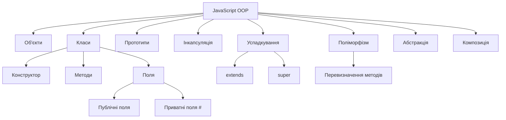

# Об'єктно-орієнтоване програмування в JavaScript

## 1. Вступ до ООП

Об'єктно-орієнтоване програмування (ООП) — це парадигма програмування, в основі якої лежить поняття **об'єктів**.

Об'єкт поєднує:

- **дані** — властивості;
- **поведінку** — методи.

Наприклад:

```javascript
const user = {
    firstName: "John",
    lastName: "Smith",

    getFullName() {
        return `${this.firstName} ${this.lastName}`;
    }
};

console.log(user.getFullName());
// John Smith
```

Об'єкт містить як дані користувача, так і поведінку, пов'язану з цими даними.

### Навіщо використовувати ООП?

ООП допомагає:

- організовувати великі застосунки;
- об'єднувати пов'язані дані та поведінку;
- повторно використовувати код;
- моделювати об'єкти реального світу;
- приховувати деталі реалізації;
- спрощувати супровід програм.

---

## 2. Об'єкти в JavaScript

Об'єкти є одними з фундаментальних будівельних блоків JavaScript.

### Літерал об'єкта

Найпростіший спосіб створити об'єкт — використати літерал об'єкта:

```javascript
const car = {
    brand: "Toyota",
    model: "Corolla",
    year: 2024
};
```

Властивості можна отримувати через крапкову нотацію:

```javascript
console.log(car.brand);
console.log(car.model);
```

або через квадратні дужки:

```javascript
console.log(car["brand"]);
console.log(car["model"]);
```

### Додавання та зміна властивостей

```javascript
car.color = "red";
car.year = 2025;

console.log(car);
```

### Видалення властивостей

```javascript
delete car.color;
```

---

## 3. Методи

Функція, яка зберігається в об'єкті, називається **методом**.

```javascript
const calculator = {
    add(a, b) {
        return a + b;
    },

    subtract(a, b) {
        return a - b;
    }
};

console.log(calculator.add(10, 5));
// 15
```

Методи дозволяють описати не тільки **що має об'єкт**, але й **що він уміє робити**.

---

## 4. Ключове слово `this`

Ключове слово `this` зазвичай посилається на об'єкт, пов'язаний із поточним викликом методу.

```javascript
const person = {
    firstName: "John",
    lastName: "Smith",

    getFullName() {
        return `${this.firstName} ${this.lastName}`;
    }
};

console.log(person.getFullName());
// John Smith
```

Тут:

```javascript
this.firstName
```

посилається на:

```javascript
person.firstName
```

### Важливо

Значення `this` визначається тим, **як викликається функція**, а не лише тим, де вона була оголошена.

Наприклад:

```javascript
const person = {
    name: "John",

    sayHello() {
        console.log(`Hello, ${this.name}!`);
    }
};

person.sayHello();
// Hello, John!
```

---

## 5. Створення декількох подібних об'єктів

Припустимо, нам потрібно створити багато користувачів:

```javascript
const user1 = {
    name: "John",
    age: 30
};

const user2 = {
    name: "Alice",
    age: 25
};

const user3 = {
    name: "Bob",
    age: 35
};
```

Це працює, але код стає повторюваним.

Нам потрібен спосіб створювати об'єкти на основі спільного опису.

У JavaScript для цього можна використовувати декілька підходів:

1. Фабричні функції
2. Функції-конструктори
3. Класи

---

# 6. Фабричні функції

**Фабрична функція** — це функція, яка створює та повертає об'єкти.

```javascript
function createUser(name, age) {
    return {
        name,
        age,

        sayHello() {
            console.log(`Hello, I'm ${this.name}`);
        }
    };
}

const user1 = createUser("John", 30);
const user2 = createUser("Alice", 25);

user1.sayHello();
user2.sayHello();
```

Результат:

```text
Hello, I'm John
Hello, I'm Alice
```

### Переваги

Фабричні функції:

- прості;
- гнучкі;
- легкі для розуміння;
- зручні, коли створення об'єкта потребує додаткової логіки.

---

# 7. Функції-конструктори

До появи класів ES6 у JavaScript широко використовувалися **функції-конструктори**.

```javascript
function User(name, age) {
    this.name = name;
    this.age = age;
}

const user1 = new User("John", 30);
const user2 = new User("Alice", 25);
```

Ключове слово `new` створює новий об'єкт.

Методи можна додавати до прототипу:

```javascript
User.prototype.sayHello = function () {
    console.log(`Hello, I'm ${this.name}`);
};

user1.sayHello();
```

Цей підхід і сьогодні важливий, оскільки допомагає зрозуміти, як працює об'єктна модель JavaScript.

---

# 8. Прототипи

JavaScript використовує **прототипну об'єктну модель**.

Кожен звичайний об'єкт може мати прототип — інший об'єкт, від якого він успадковує властивості та методи.

Наприклад:

```javascript
const user = {
    name: "John"
};

console.log(Object.getPrototypeOf(user));
```

Об'єкти можуть отримувати властивості через **ланцюжок прототипів**.

Концептуально:

```text
user
  |
  v
Object.prototype
  |
  v
null
```

Коли JavaScript виконує:

```javascript
user.toString();
```

спочатку він шукає `toString` у `user`.

Якщо властивість не знайдена, JavaScript перевіряє прототип об'єкта.

Потім пошук продовжується вгору по ланцюжку прототипів.

---

# 9. Класи ES6

Сучасний JavaScript надає синтаксис `class`.

```javascript
class User {
    constructor(name, age) {
        this.name = name;
        this.age = age;
    }

    sayHello() {
        console.log(`Hello, I'm ${this.name}`);
    }
}
```

Тепер ми можемо створювати об'єкти:

```javascript
const user1 = new User("John", 30);
const user2 = new User("Alice", 25);

user1.sayHello();
user2.sayHello();
```

Синтаксис `class` надає зручніший спосіб роботи з прототипною моделлю JavaScript.

---

# 10. Класи та об'єкти

**Клас** описує структуру та поведінку об'єктів.

**Об'єкт** є екземпляром, створеним на основі класу.

```javascript
class Car {
    constructor(brand, model) {
        this.brand = brand;
        this.model = model;
    }
}

const car1 = new Car("Toyota", "Corolla");
const car2 = new Car("BMW", "X5");
```

Концептуально:

```text
             Car
              |
       +------+------+
       |             |
       v             v
    car1           car2
  Toyota          BMW
  Corolla         X5
```

---

# 11. Конструктори

Метод `constructor()` автоматично викликається, коли об'єкт створюється за допомогою `new`.

```javascript
class Person {
    constructor(name, age) {
        this.name = name;
        this.age = age;
    }
}

const person = new Person("John", 30);
```

Конструктор ініціалізує об'єкт.

### Параметри конструктора

```javascript
class Product {
    constructor(name, price) {
        this.name = name;
        this.price = price;
    }
}

const product = new Product("Laptop", 1200);
```

---

# 12. Методи екземпляра

Методи, визначені всередині класу, доступні його екземплярам.

```javascript
class Rectangle {
    constructor(width, height) {
        this.width = width;
        this.height = height;
    }

    getArea() {
        return this.width * this.height;
    }

    getPerimeter() {
        return 2 * (this.width + this.height);
    }
}

const rectangle = new Rectangle(10, 5);

console.log(rectangle.getArea());
// 50

console.log(rectangle.getPerimeter());
// 30
```

---

# 13. Поля екземпляра

Властивості можна ініціалізувати безпосередньо в класі.

```javascript
class User {
    role = "user";

    constructor(name) {
        this.name = name;
    }
}

const user = new User("John");

console.log(user.name);
console.log(user.role);
```

---

# 14. Публічні поля

За замовчуванням поля класу є публічними.

```javascript
class BankAccount {
    balance = 0;

    constructor(owner) {
        this.owner = owner;
    }
}

const account = new BankAccount("John");

account.balance = 1000;
```

Будь-який код, який має доступ до об'єкта, може змінити публічні поля.

Іноді це небажано.

Тут виникає потреба в **інкапсуляції**.

---

# 15. Приватні поля

Сучасний JavaScript підтримує приватні поля класу за допомогою `#`.

```javascript
class BankAccount {
    #balance = 0;

    constructor(owner) {
        this.owner = owner;
    }

    deposit(amount) {
        this.#balance += amount;
    }

    getBalance() {
        return this.#balance;
    }
}

const account = new BankAccount("John");

account.deposit(500);

console.log(account.getBalance());
// 500
```

Це некоректно:

```javascript
account.#balance = 100000;
```

Приватні поля можуть використовуватися тільки всередині класу.

---

# 16. Інкапсуляція

**Інкапсуляція** означає об'єднання даних і поведінки в одному об'єкті з одночасним контролем доступу до внутрішнього стану.

Наприклад:

```javascript
class BankAccount {
    #balance = 0;

    deposit(amount) {
        if (amount <= 0) {
            throw new Error("Amount must be positive");
        }

        this.#balance += amount;
    }

    withdraw(amount) {
        if (amount > this.#balance) {
            throw new Error("Insufficient funds");
        }

        this.#balance -= amount;
    }

    getBalance() {
        return this.#balance;
    }
}
```

Користувачу класу не потрібно знати, як саме зберігається баланс.

Він використовує публічний інтерфейс:

```javascript
account.deposit(100);
account.withdraw(50);
console.log(account.getBalance());
```

---

# 17. Геттери та сеттери

Геттери дозволяють надавати доступ до обчислюваних або контрольованих значень.

```javascript
class Person {
    constructor(firstName, lastName) {
        this.firstName = firstName;
        this.lastName = lastName;
    }

    get fullName() {
        return `${this.firstName} ${this.lastName}`;
    }
}

const person = new Person("John", "Smith");

console.log(person.fullName);
```

Зверніть увагу: ми не викликаємо його як функцію:

```javascript
person.fullName
```

а не:

```javascript
person.fullName()
```

### Сеттер

```javascript
class User {
    constructor(name) {
        this.name = name;
    }

    set username(value) {
        this.name = value.trim();
    }
}

const user = new User("John");

user.username = " Alice ";

console.log(user.name);
// Alice
```

Геттери та сеттери корисні для валідації та контрольованого доступу до даних.

---

# 18. Статичні члени

Статичний член належить самому класу, а не окремим об'єктам.

```javascript
class MathHelper {
    static square(number) {
        return number * number;
    }
}

console.log(MathHelper.square(5));
// 25
```

Нам не потрібно створювати об'єкт:

```javascript
MathHelper.square(5);
```

замість:

```javascript
const helper = new MathHelper();
```

Статичні члени корисні для функціональності, яка не залежить від конкретного екземпляра.

---

# 19. Успадкування

**Успадкування** дозволяє одному класу повторно використовувати та розширювати інший клас.

```javascript
class Animal {
    constructor(name) {
        this.name = name;
    }

    eat() {
        console.log(`${this.name} is eating`);
    }
}

class Dog extends Animal {
    bark() {
        console.log(`${this.name} says Woof!`);
    }
}

const dog = new Dog("Rex");

dog.eat();
dog.bark();
```

`Dog` успадковує метод `eat()` від `Animal`.

Концептуально:

```text
Animal
   |
   | extends
   v
  Dog
```

---

# 20. Ключове слово `super`

`super` використовується для доступу до функціональності батьківського класу.

```javascript
class Animal {
    constructor(name) {
        this.name = name;
    }
}

class Dog extends Animal {
    constructor(name, breed) {
        super(name);
        this.breed = breed;
    }
}

const dog = new Dog("Rex", "Labrador");
```

Батьківський конструктор потрібно викликати перед використанням `this` у конструкторі похідного класу.

```javascript
super(name);
```

викликає конструктор `Animal`.

---

# 21. Перевизначення методів

Дочірній клас може надати власну реалізацію методу.

```javascript
class Animal {
    makeSound() {
        console.log("Some sound");
    }
}

class Dog extends Animal {
    makeSound() {
        console.log("Woof!");
    }
}

class Cat extends Animal {
    makeSound() {
        console.log("Meow!");
    }
}
```

Тепер:

```javascript
const dog = new Dog();
const cat = new Cat();

dog.makeSound();
cat.makeSound();
```

Результат:

```text
Woof!
Meow!
```

---

# 22. Поліморфізм

**Поліморфізм** означає, що різні об'єкти можуть реагувати на однаковий виклик методу по-різному.

Використаємо попередній приклад:

```javascript
const animals = [
    new Dog(),
    new Cat()
];

animals.forEach(animal => {
    animal.makeSound();
});
```

Результат:

```text
Woof!
Meow!
```

Коду не потрібно знати, чи є `animal` об'єктом `Dog` або `Cat`.

Він просто викликає:

```javascript
animal.makeSound();
```

Це одна з найкорисніших ідей ООП.

---

# 23. Абстракція

**Абстракція** означає надання лише важливих частин об'єкта та приховування непотрібних деталей реалізації.

Наприклад:

```javascript
class CoffeeMachine {
    makeCoffee() {
        this.#heatWater();
        this.#grindCoffee();
        this.#brew();
        console.log("Coffee is ready!");
    }

    #heatWater() {
        console.log("Heating water...");
    }

    #grindCoffee() {
        console.log("Grinding coffee...");
    }

    #brew() {
        console.log("Brewing...");
    }
}

const machine = new CoffeeMachine();

machine.makeCoffee();
```

Користувачу достатньо:

```javascript
machine.makeCoffee();
```

Йому не потрібно знати внутрішню послідовність операцій.

---

# 24. Чотири основні концепції ООП

Чотири концепції, які традиційно пов'язують з ООП:

| Концепція | Значення |
|---|---|
| Інкапсуляція | Захист і контроль стану об'єкта |
| Абстракція | Приховування непотрібних деталей реалізації |
| Успадкування | Повторне використання та розширення існуючої поведінки |
| Поліморфізм | Один інтерфейс, різна поведінка |

Спрощена схема:

```text
                 OOP
                  |
       +----------+----------+
       |          |          |
       v          v          v
 Інкапсуляція  Успадкування  Поліморфізм
       |
       v
   Абстракція
```

Ці концепції корисні, але JavaScript не вимагає використання всіх їх у кожній програмі.

---

# 25. Композиція

Успадкування не завжди є найкращим рішенням.

Розглянемо:

```javascript
class Animal {
    eat() {}
}

class Dog extends Animal {
    bark() {}
}
```

Це моделює відношення **"є" (is-a)**:

```text
Dog IS AN Animal
```

Композиція моделює відношення **"має" (has-a)**.

Наприклад:

```javascript
const canEat = {
    eat() {
        console.log("Eating...");
    }
};

const canWalk = {
    walk() {
        console.log("Walking...");
    }
};

const dog = {
    name: "Rex",
    ...canEat,
    ...canWalk
};

dog.eat();
dog.walk();
```

Об'єкт складається з декількох незалежних поведінок.

---

# 26. Композиція проти успадкування

### Успадкування

Використовуйте успадкування, коли існує чіткий ієрархічний зв'язок.

```text
Vehicle
   |
   +-- Car
   |
   +-- Motorcycle
```

### Композиція

Використовуйте композицію, коли об'єкт можна побудувати з повторно використовуваних поведінок.

```text
Dog
 |
 +-- canEat
 +-- canWalk
 +-- canRun
```

Корисне правило:

> Віддавайте перевагу композиції, якщо успадкування не описує чіткого відношення "є".

---

# 27. Практичний приклад: Інтернет-магазин

Створимо невеликий приклад.

## Product

```javascript
class Product {
    constructor(name, price) {
        this.name = name;
        this.price = price;
    }

    getPrice() {
        return this.price;
    }
}
```

## Shopping Cart

```javascript
class ShoppingCart {
    #items = [];

    addProduct(product) {
        this.#items.push(product);
    }

    getTotal() {
        return this.#items.reduce(
            (total, product) => total + product.getPrice(),
            0
        );
    }
}
```

## Використання

```javascript
const laptop = new Product("Laptop", 1200);
const mouse = new Product("Mouse", 50);

const cart = new ShoppingCart();

cart.addProduct(laptop);
cart.addProduct(mouse);

console.log(cart.getTotal());
// 1250
```

Клас `ShoppingCart` контролює свою внутрішню колекцію товарів.

---

# 28. Розширення прикладу

Можемо додати спеціалізовані типи товарів.

```javascript
class DigitalProduct extends Product {
    constructor(name, price, fileSize) {
        super(name, price);
        this.fileSize = fileSize;
    }
}

class PhysicalProduct extends Product {
    constructor(name, price, weight) {
        super(name, price);
        this.weight = weight;
    }
}
```

Тепер обидва об'єкти мають:

```javascript
getPrice()
```

але можуть мати додаткову різну поведінку.

---

# 29. Поліморфізм у прикладі інтернет-магазину

Можемо додати різну логіку доставки:

```javascript
class Product {
    constructor(name, price) {
        this.name = name;
        this.price = price;
    }

    calculateShipping() {
        return 0;
    }
}

class PhysicalProduct extends Product {
    constructor(name, price, weight) {
        super(name, price);
        this.weight = weight;
    }

    calculateShipping() {
        return this.weight * 2;
    }
}

class DigitalProduct extends Product {
    calculateShipping() {
        return 0;
    }
}
```

Тепер:

```javascript
const products = [
    new PhysicalProduct("Laptop", 1200, 3),
    new DigitalProduct("E-book", 20)
];

products.forEach(product => {
    console.log(product.calculateShipping());
});
```

Один і той самий виклик методу дає різні результати.

---

# 30. Синтаксис класів і синтаксис прототипів

Ці два підходи тісно пов'язані.

### Синтаксис класу

```javascript
class User {
    constructor(name) {
        this.name = name;
    }

    sayHello() {
        console.log(`Hello ${this.name}`);
    }
}
```

### Синтаксис прототипу

```javascript
function User(name) {
    this.name = name;
}

User.prototype.sayHello = function () {
    console.log(`Hello ${this.name}`);
};
```

Синтаксис `class` є зручнішим, але JavaScript і надалі використовує прототипи.

---

# 31. Ланцюжок прототипів

Розглянемо:

```javascript
class User {
    sayHello() {
        console.log("Hello");
    }
}

const user = new User();
```

Концептуально:

```text
user
 |
 v
User.prototype
 |
 v
Object.prototype
 |
 v
null
```

Коли ми виконуємо:

```javascript
user.sayHello();
```

JavaScript шукає `sayHello`:

1. в `user`;
2. в `User.prototype`;
3. далі в ланцюжку прототипів, якщо потрібно.

---

# 32. `instanceof`

Оператор `instanceof` дозволяє перевірити, чи є об'єкт екземпляром певного класу або конструктора.

```javascript
class User {}

const user = new User();

console.log(user instanceof User);
// true

console.log(user instanceof Object);
// true
```

Інший приклад:

```javascript
class Animal {}

class Dog extends Animal {}

const dog = new Dog();

console.log(dog instanceof Dog);
// true

console.log(dog instanceof Animal);
// true
```

---

# 33. `Object.getPrototypeOf()`

Можна отримати прототип об'єкта:

```javascript
class User {}

const user = new User();

console.log(
    Object.getPrototypeOf(user) === User.prototype
);
// true
```

Це корисно під час вивчення того, як працює прототипна система JavaScript.

---

# 34. Поширені помилки в ООП

## Помилка 1: Використання класів для всього

Не кожна задача потребує класу.

Іноді проста функція є кращим рішенням:

```javascript
function calculateTotal(price, quantity) {
    return price * quantity;
}
```

---

## Помилка 2: Надмірне успадкування

Глибокі ієрархії успадкування можуть бути складними для супроводу.

Уникайте структур на кшталт:

```text
A
|
B
|
C
|
D
|
E
|
F
```

якщо композиція буде простішою.

---

## Помилка 3: Надмірне відкриття внутрішнього стану

Не варто без потреби робити весь стан об'єкта публічним і змінюваним.

Замість:

```javascript
account.balance = -100000;
```

краще використовувати контрольовані методи:

```javascript
account.deposit(100);
account.withdraw(50);
```

---

## Помилка 4: Нерозуміння `this`

Завжди потрібно враховувати, як саме викликається функція.

```javascript
const user = {
    name: "John",

    sayHello() {
        console.log(this.name);
    }
};

user.sayHello();
```

Тут `this` посилається на `user`.

---

# 35. ООП та функціональне програмування

JavaScript підтримує декілька стилів програмування.

### ООП-стиль

```javascript
class ShoppingCart {
    constructor() {
        this.items = [];
    }

    add(item) {
        this.items.push(item);
    }

    getTotal() {
        return this.items.reduce(
            (total, item) => total + item.price,
            0
        );
    }
}
```

### Функціональний стиль

```javascript
const getTotal = items =>
    items.reduce(
        (total, item) => total + item.price,
        0
    );
```

Обидва підходи можуть бути корисними.

Сучасні JavaScript-застосунки часто поєднують їх.

---

# 36. Коли варто використовувати ООП?

ООП може бути корисним, коли:

- застосунок містить багато сутностей;
- сутності мають і стан, і поведінку;
- об'єкти мають чіткі відповідальності;
- декілька об'єктів використовують спільну поведінку;
- корисно приховати внутрішній стан;
- предметну область природно можна представити у вигляді об'єктів.

Приклади:

- ігри;
- інтернет-магазини;
- банківські системи;
- графічні інтерфейси;
- симуляції;
- корпоративні застосунки.

---

# 37. Коли ООП може бути зайвим?

Клас може бути непотрібним, коли задача дуже проста:

```javascript
const numbers = [1, 2, 3, 4, 5];

const doubled = numbers.map(number => number * 2);
```

Створення класу:

```javascript
class NumberProcessor {
    // ...
}
```

у такому випадку, найімовірніше, лише ускладнить код.

Мета полягає не в тому, щоб використовувати ООП всюди.

Мета — вибрати найбільш доречний підхід до програмування.

---

# 38. Шпаргалка з ООП

| Можливість | Синтаксис |
|---|---|
| Клас | `class User {}` |
| Конструктор | `constructor() {}` |
| Екземпляр | `new User()` |
| Метод | `sayHello() {}` |
| Приватне поле | `#balance` |
| Геттер | `get value() {}` |
| Сеттер | `set value(v) {}` |
| Статичний метод | `static create() {}` |
| Успадкування | `class Dog extends Animal` |
| Конструктор батьківського класу | `super()` |
| Метод батьківського класу | `super.method()` |
| Прототип | `User.prototype` |
| Перевірка екземпляра | `object instanceof User` |

---

# 39. Основні висновки

JavaScript є мультипарадигмальною мовою.

Вона підтримує:

- процедурне програмування;
- функціональне програмування;
- об'єктно-орієнтоване програмування;
- прототипне програмування.

До важливих концепцій ООП у JavaScript належать:

1. Об'єкти
2. Класи
3. Конструктори
4. Методи
5. `this`
6. Інкапсуляція
7. Приватні поля
8. Геттери та сеттери
9. Статичні члени
10. Успадкування
11. Перевизначення методів
12. Поліморфізм
13. Абстракція
14. Композиція
15. Прототипи

Найважливіше — не просто запам'ятати синтаксис.

Важливо навчитися **проєктувати об'єкти з чітко визначеними відповідальностями**.

---

# 40. Вправи

## Вправа 1 — Person

Створіть клас `Person` з:

- `firstName`;
- `lastName`;
- `age`.

Додайте метод:

```javascript
getFullName()
```

Приклад:

```javascript
const person = new Person("John", "Smith", 30);

console.log(person.getFullName());
// John Smith
```

---

## Вправа 2 — Bank Account

Створіть клас `BankAccount`.

Вимоги:

- приватне поле `#balance`;
- метод `deposit(amount)`;
- метод `withdraw(amount)`;
- метод `getBalance()`.

Не дозволяйте зняти більше грошей, ніж є на поточному балансі.

---

## Вправа 3 — Rectangle

Створіть клас `Rectangle` з:

- `width`;
- `height`;
- `getArea()`;
- `getPerimeter()`.

Приклад:

```javascript
const rectangle = new Rectangle(10, 5);

console.log(rectangle.getArea());
// 50
```

---

## Вправа 4 — Animals

Створіть:

```text
Animal
  |
  +-- Dog
  |
  +-- Cat
```

Базовий клас повинен містити:

```javascript
makeSound()
```

Перевизначте його в `Dog` та `Cat`.

Потім:

```javascript
const animals = [
    new Dog(),
    new Cat()
];

animals.forEach(animal => animal.makeSound());
```

---

## Вправа 5 — Shopping Cart

Створіть:

```text
Product
ShoppingCart
```

`Product` повинен містити:

- name;
- price.

`ShoppingCart` повинен:

- додавати товари;
- видаляти товари;
- обчислювати загальну вартість.

Зробіть внутрішній список товарів кошика приватним.

---

# 41. Фінальне завдання

Створіть невелику систему **керування бібліотекою**.

Система повинна містити:

```text
Library
 |
 +-- Book
 |
 +-- User
 |
 +-- Librarian
```

### Book

Властивості:

- title;
- author;
- ISBN;
- availability.

Методи:

```javascript
borrow()
returnBook()
```

### User

Властивості:

- name;
- borrowed books.

Методи:

```javascript
borrowBook()
returnBook()
```

### Library

Властивості:

- books;
- users.

Методи:

```javascript
addBook()
removeBook()
registerUser()
findBook()
```

### Додаткові вимоги

Використайте:

- класи;
- приватні поля;
- геттери/сеттери там, де це доречно;
- успадкування там, де воно має сенс;
- композицію там, де вона має сенс;
- поліморфізм, якщо можете знайти для нього корисний випадок.

---

# 42. Підсумкова діаграма



---

# 43. Фінальний висновок

ООП у JavaScript — це більше, ніж ключове слово `class`.

Щоб зрозуміти ООП у JavaScript, потрібно розуміти взаємозв'язок між:

```text
Об'єкти
   ↓
Класи
   ↓
Екземпляри
   ↓
Методи
   ↓
Прототипи
   ↓
Успадкування
   ↓
Поліморфізм
```

Водночас JavaScript є гнучкою мовою.

Не потрібно використовувати класи всюди.

Якісний JavaScript-код — це вибір **найпростішої структури, яка чітко описує поставлену задачу**.
